# @neptune-software/google-abap-sdk

## Introduction
This is an additional integration scenario for the amazing Google ABAP SDK Library.
The main purpose of this library is to allow sending Firebase Push Notifications (aka Firebase Cloud Messaging) via the new HTTP v1 API (https://fcm.googleapis.com/v1/projects/*myproject-b5ae1*/messages:send) as the legacy FCM API (https://fcm.googleapis.com/fcm/send) was deprecated on June 20, 2023, and will be removed in June 2024. You find more information about the deprecation and migration steps [here](https://firebase.google.com/docs/cloud-messaging/migrate-v1).
The biggest challenge for the new API is that the authentication takes place through short-lived OAuth access tokens that need to be obtained before sending the actual request. The main ABAP Cloud Library already has all implementation for the correct handling of tokens in place that's why we choose to have the main Google Cloud ABAP SDK as a foundation for this additional functionality.

So please make sure you **FIRST INSTALL AND SETUP THE GOOGLE CLOUD ABAP SDK** (see [Prerequisites](#Prerequisites)) before using this package because you would get syntax errors otherwise. 

## Version Dependency
Depending on the **GOOGLE CLOUD ABAP SDK Version** you need to install different versions of this repository.

If you are using **GOOGLE CLOUD ABAP SDK 1.5** please install Version 1.0 of this Repository (https://github.com/neptune-software/google-abap-sdk/releases/tag/v1.0.0).

If you are using **GOOGLE CLOUD ABAP SDK 1.7** please install Version 2.0 of this Repository (https://github.com/neptune-software/google-abap-sdk/releases/tag/v2.0.0).

If you don't ensure to download the correct version you will get a syntax error that is also easily fixable on your own if you want (see https://github.com/neptune-software/google-abap-sdk/commit/9e1cf05d7b9cc622386a546295f574f5eb93eb25)

## Background
The Neptune DXP allows you to create Mobile Clients both for Android and iOS via the Cordova framework. Our solution offers an easy way to integrate Firebase Cloud Messaging (Push Notifications via Firebase) into your Mobile Clients by configuring a few parameters in our Cockpit. Our Neptune DXP SAP Edition is an ABAP Addon that comes with the Function Module called /NEPTUNE/PUSH_FIREBASE. It allows you to send push notifications to the corresponding Mobile Clients. However, since this function module is using the legacy FCM API, this new repository leveraging the well-established Google Cloud ABAP SDK is the easy-to-use successor of the /NEPTUNE/PUSH_FIREBASE function module.

In addition to the Neptune DXP integration, you can also use this library for general-purpose Firebase Cloud Messaging scenarios outside a Neptune DXP use case.

## Prerequisites
Before using this library you need to install the correct [Cloud ABAP SDK version](https://cloud.google.com/solutions/sap/docs/abap-sdk/latest/all-guides). It comes with a very detailed install and setup guide so please follow that upfront. After you install the corresponding transport (at least the "Token" approach is required. The additional OAuth transport can be installed but is not required) you need to set up the general authentication settings that are mentioned in the documentation that will then later be used for this FCM library.

## Artifacts
This package comes with a class (ZCL_GOOG_FCM_V1) that implements the calling of the new HTTP v1 API via the following public methods.
| Method                       | Purpose                                                                    |
| ---------------------------- | -------------------------------------------------------------------------- |
| MESSAGES_SEND                | Send a single message via a topic or a device token                        |
| MESSAGES_SEND_EACH           | Send many different messages to many different topics or device tokens     |
| MESSAGES_SEND_EACH_FOR_MC    | Send the same message to many device tokens                                |

In addition to that, there is also a demo program (ZGOOG_R_DEMO_FIREBASE) that allows you to easily test if the Cloud Messaging works correctly.

## Tests
This library has been created and tested with the following Software Versions.
* Neptune DXP SAP Edition v23.10.0004
* cordova-ios@7.0.1
* cordova-android@11.0.0
* @havesource/cordova-plugin-push@4.0.0

The actual mobile clients have been created via the Neptune Mobile Build Service.

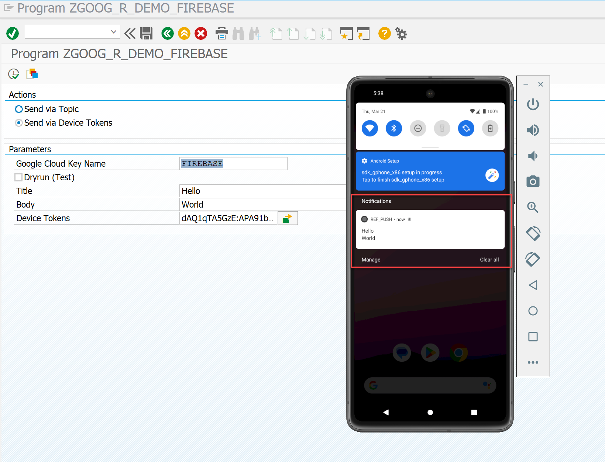

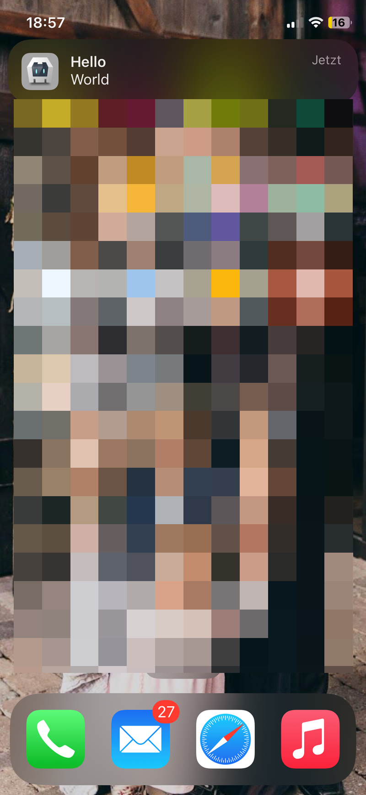

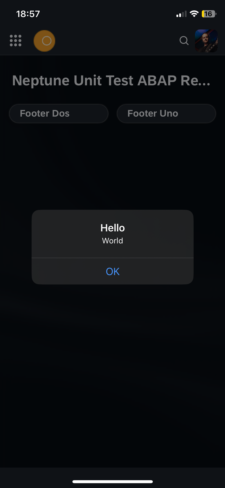

## Setup for Firebase Cloud Messaging
The general setup for the Google Cloud ABAP SDK needs to be followed to be able to use this repository.
There are many different options to perform the authentication against the Google Cloud Platform. In our test cases, we were using the approach via:
[Authenticate using JSON Web Tokens (JWT)](https://cloud.google.com/solutions/sap/docs/abap-sdk/latest/authentication#externally_hosted_use_token).
When setting up Firebase cloud messaging in the Firebase console you will already get a service account generated for you. You can navigate to the service account from the Firebase console in the settings overview:
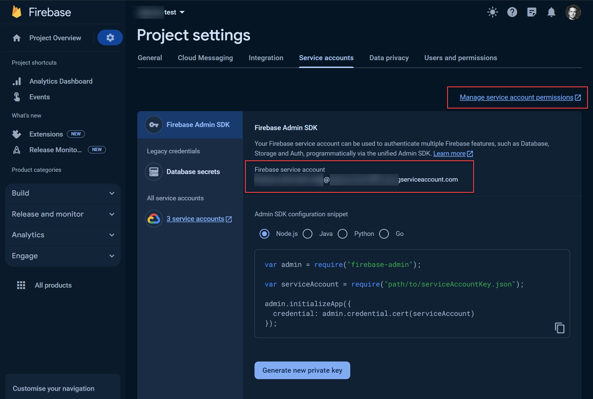
The auto-generated service account will have a private key that is of type JSON as this is the recommended key type by Google. For our setup, we however required a p12 file to be able to put that into STRUST. That's why we needed to generate an additional Key for the generated Service account in the Google Cloud console (which you can navigate to from the Firebase service account settings).
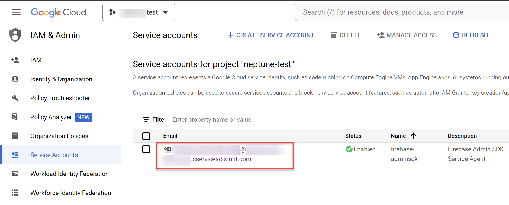

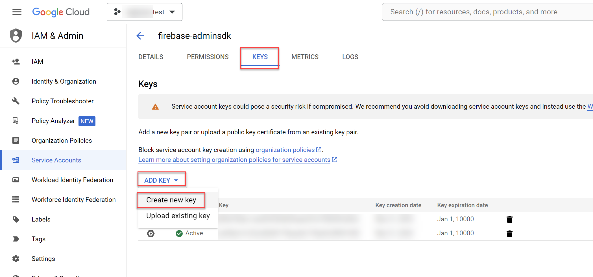

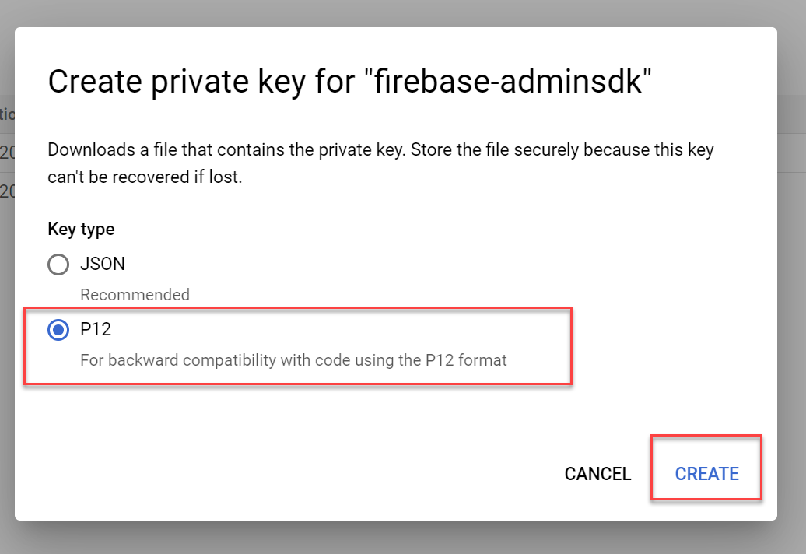

The rest of the setup mentioned in the general Authentication step for the Google Cloud ABAP SDK can then be followed with that P12 file:

https://cloud.google.com/solutions/sap/docs/abap-sdk/latest/authentication#jwt-create-p12-key

https://cloud.google.com/solutions/sap/docs/abap-sdk/latest/authentication#jwt-import-service-account-key-strust


## Sample Configuration 
Below you find the setup that we used for setting up Firebase cloud messaging from an SAP configuration perspective. The Client Key Identifier can freely be chosen (in our case we used **FIREBASE**). When instantiating the class `zcl_goog_fcm_v1` you need to provide the name of the client key so the framework can pick up all required settings for the communication against the Google Cloud services.

### STRUST PSE File
We downloaded the p12 file from the service account. Our SAP Basis administrator converted the p12 file with the `sapgenpse` command line tool to a pse file that we then were able to import into STRUST in the newly created note (part of the setup).
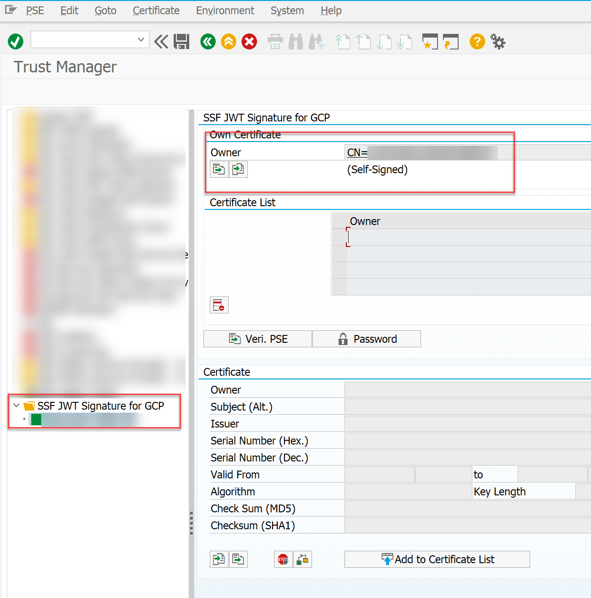

### Configure Client Key
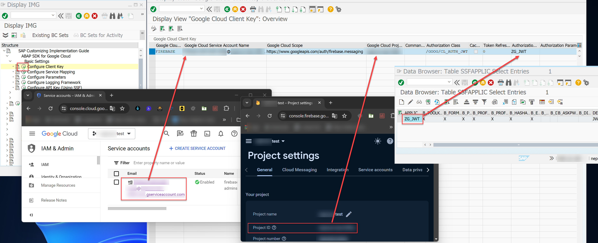

### Configure Service Mapping
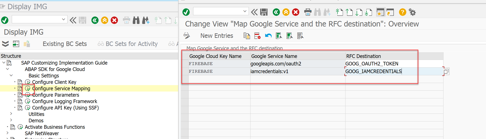

### Configure Parameters
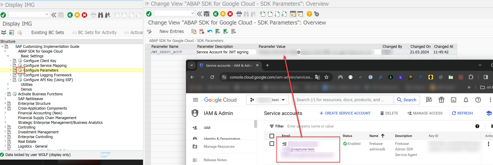


## Additional Notes
This library is developed in the Z-Namespace without any dependencies against Neptune DXP SAP Edition development artifacts.
So you can also use it in a Neptune DXP Open Edition or a completely different scenario. Therefore you will need to select the device IDs that you want to send the push notification to in your custom ABAP Code by selecting them from table /NEPTUNE/DEVICES. A Device ID will be registered automatically in the Neptune DXP Mobile Client framework after successful authentication against the SAP System per SAP User.
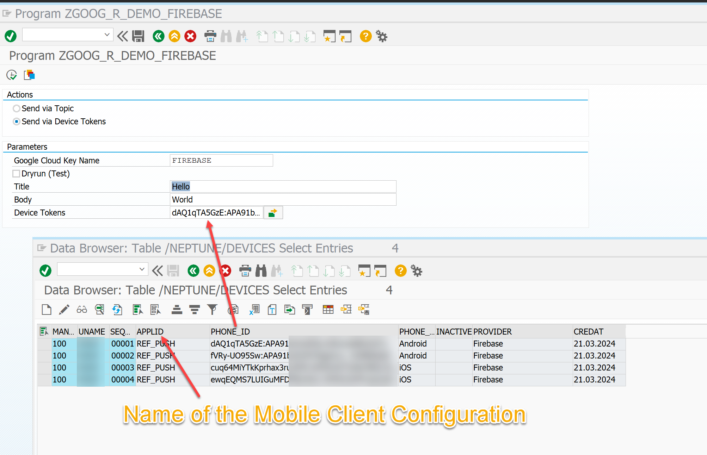

Another important note is that the new HTTP V1 API **does not support multicast messages** (sending a push Notification to multiple device IDs with one call) (https://firebase.google.com/support/faq#fcm-depr-multiple-tokens). So there will be one HTTP call per push notification that should be sent to a device ID. However, this Framework offers different methods that also allow you to pass an internal table with device IDs and then perform multiple HTTP calls per device ID automatically for you.

## Gotchas

### Error Response
When testing the Push notification with the program `ZGOOG_R_DEMO_FIREBASE` and providing a device token you might get an error response *Data Type not yet supported*. 
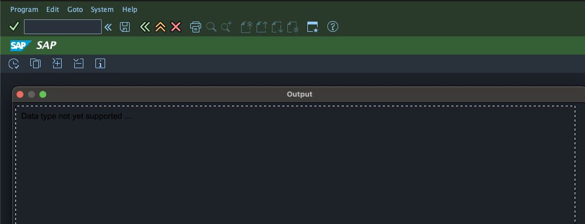
When debugging the code in `/GOOG/CL_HTTP_CLIENT->HANDLE_HTTP_RESPONSE` you would get a error JSON response in the response stating that *"The registration token is not a valid FCM registration token"*:
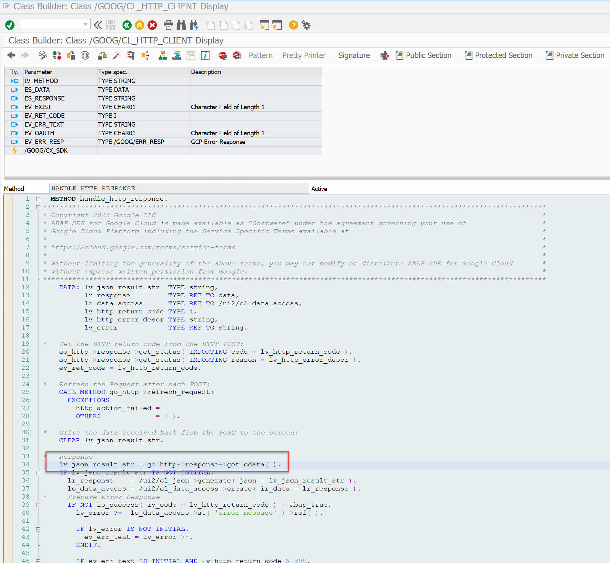

```json
{
  "error": {
    "code": 400,
    "message": "The registration token is not a valid FCM registration token",
    "status": "INVALID_ARGUMENT",
    "details": [
      {
        "@type": "type.googleapis.com/google.firebase.fcm.v1.FcmError",
        "errorCode": "INVALID_ARGUMENT"
      }
    ]
  }
}
```
This response would be send back when the provided device token is invalid.
You need to be sure that you provide the actual device token. 

> [!WARNING]
> Probably you will copy the value of a token out of table `/NEPTUNE/DEVICES`. SAPs ALV Grid has a limit of characters that can be shown in a column that is **LESS THAN THE LENGTH OF THE DEVICE TOKEN**.
> So if you copy the device token from the column in the ALV Grid directly you will not get the full device token but a truncated version of it. Instead you should make sure you use `SE16` (not `SE16N`) and open the detail view of a device registration to get the full device token into your clipboard:
> 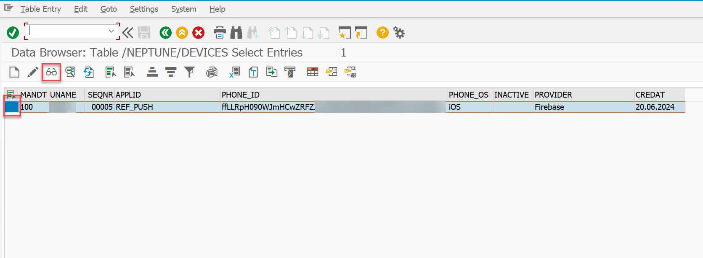 
> 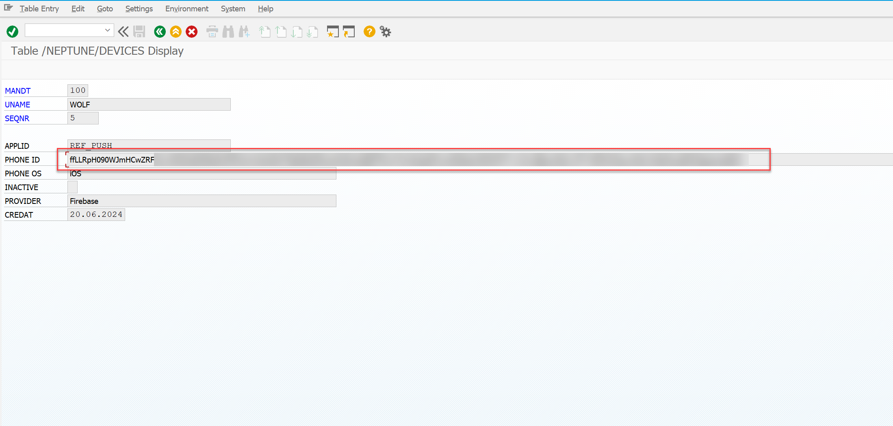